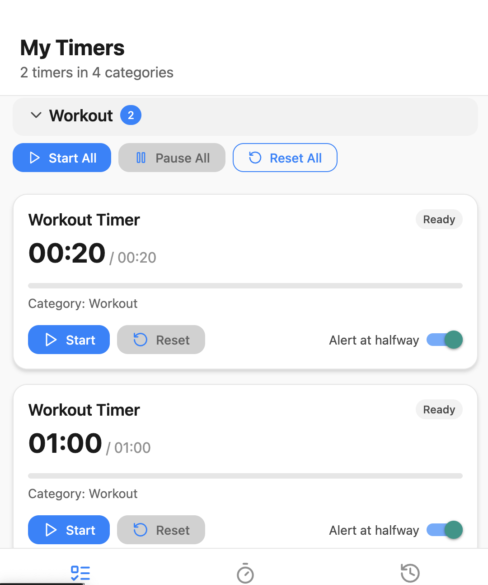

# Multi Timer Manager

A React Native application that allows users to create, manage, and interact with multiple customizable timers. The app emphasizes clean UI/UX and minimal third-party dependencies while supporting grouped actions, progress visualization, and local data persistence.

---

## 🧭 Step-by-Step Usage Guide

### 🛠 1. Add a New Timer

Navigate to the add screen and enter timer details like name, duration, and category.


---

### 🧾 2. View All Timers Grouped by Category

Timers are shown grouped by their category in collapsible sections.




---

### 🎛 3. Manage Timers (Start, Pause, Reset)

You can control each timer individually — start, pause, or reset them.


---

### 📊 4. Progress Visualization

Each timer shows a progress bar to visualize time left.


---

### 📦 5. Bulk Actions per Category

Use the category header controls to start, pause, or reset all timers within a category.


---

### 🎉 6. Timer Completion Modal

When a timer finishes, a modal appears with a congratulatory message.


---

### 📤 7. Export/Debug View

If you implemented an export or debug screen:


---

## ⚙️ Stack

- **React Native**: `0.79.1`
- **Expo**: `53.0.0`
- **React**: `19.0.0`
- **Expo Router**: `5.0.2`
- **AsyncStorage**: `1.21.0`
- **React Navigation**: `7.x`
- **Minimal third-party libraries** to keep performance optimal

## 🚀 Project Setup & Running Guide

### ✅ Prerequisites

- **Node.js** `v20+`
- **npm** `v9+` or **yarn**
- **Expo CLI** (globally installed)

```bash
npm install -g expo-cli
```

## 🧱 1. Clone & Install

```bash
git clone https://github.com/J4Web/Multi-Timer-Manager.git
cd Multi-Timer-Manager
npm install
```

## 🏗 2. Start the Development Server

```bash
npm run dev
```

---

## 📌 Summary

This project demonstrates practical implementation of:

- State management for concurrent timers
- Grouped UI interactions
- Async data storage and retrieval
- Visual progress feedback
- Clean and intuitive mobile interface

## 

##Find the APK link below:
https://github.com/J4Web/Multi-Timer-Manager/releases/tag/v1.0.0


